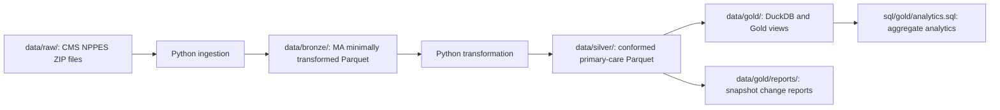

# NPPES Provider Directory Change Pipeline

[](https://github.com/dnylad/nppes-provider-directory-pipeline/actions/workflows/tests.yml)

## Project summary

A beginner-friendly Python data-engineering project that turns CMS NPPES weekly provider-directory extracts into reproducible Massachusetts primary-care datasets, a local DuckDB Gold analytics layer, and cautious snapshot-change reports. Raw source files remain local and are never committed to Git.

## Massachusetts primary-care use case

Healthcare operations, provider-directory, and network teams need a repeatable way to understand the Massachusetts primary-care directory footprint, measure directory-field completeness, and compare released NPPES files over time. This project provides a small, auditable foundation for those tasks.



## Medallion Architecture

- **Source landing — `data/raw/`:** local CMS ZIP files, unchanged and excluded from Git.
- **Bronze — `data/bronze/`:** Massachusetts provider Parquet with minimal transformation: expected-column validation, retained fields, and primary-practice-state filtering. It is raw-ish, not raw.
- **Silver — `data/silver/`:** cleaned, conformed Version 1 primary-care `providers` and `provider_taxonomies` Parquet tables plus an aggregate quality report.
- **Gold — `data/gold/` and `sql/gold/`:** the local DuckDB database, reusable analytic views, aggregate SQL, and generated aggregate change reports.

## Technology stack

- **Python 3.12** for pipeline orchestration
- **pandas** for tabular processing
- **PyArrow and Parquet** for efficient local datasets
- **DuckDB** for local analytics and reusable views
- **pytest** for synthetic-data validation
- **GitHub Actions** for continuous integration

## Version 1 cohort definition

Version 1 includes individual providers whose **primary business-practice location state is Massachusetts** and who report any of these NPPES taxonomy codes. The matching taxonomy does not need to be marked as primary.

| Taxonomy | Code |
| --- | --- |
| Family Medicine | `207Q00000X` |
| Internal Medicine | `207R00000X` |
| General Practice | `208D00000X` |
| Pediatrics | `208000000X` |

Organization records, advanced practice providers, subspecialties, and non-primary practice locations are outside Version 1 scope.

## Data source and limitations

The source is the [CMS NPPES Version 2 downloadable files](https://download.cms.gov/nppes/NPI_Files.html).

- NPPES information is self-reported; it does not prove licensure, credentialing, network participation, appointment availability, or whether a provider accepts new patients.
- The current workflow uses weekly incremental files. These are not complete statewide baselines, so “newly observed” and “not observed” records in a comparison do not establish statewide additions or removals.
- ZIP-level counts describe directory coverage, not care access, capacity, demand, or network adequacy.

## Setup

Prerequisite: Python 3.12 or another supported Python 3 release installed locally.

```powershell
python -m venv .venv
.\.venv\Scripts\Activate.ps1
python -m pip install -r requirements.txt
```

## Run the pipeline

Keep CMS ZIP files in `data/raw/`; that landing zone is intentionally ignored by Git. Replace placeholders below with your local filenames and snapshot label.

1. Ingest a weekly ZIP to a Bronze Massachusetts Parquet dataset.

   ```powershell
   .\.venv\Scripts\python.exe src\ingest.py `
     data\raw\<nppes_weekly_zip>.zip `
     data\bronze\<snapshot_label>
   ```

2. Transform the Bronze snapshot into Silver Version 1 primary-care tables.

   ```powershell
   .\.venv\Scripts\python.exe src\transform.py `
     data\bronze\<snapshot_label>\<nppes_weekly_zip>_massachusetts.parquet `
     data\silver\<snapshot_label>
   ```

3. Load Silver Parquet into local Gold DuckDB. Reruns replace tables and views rather than append duplicate rows.

   ```powershell
   .\.venv\Scripts\python.exe src\load.py `
     data\silver\<snapshot_label> `
     data\gold\nppes_provider_directory.duckdb
   ```

4. Run aggregate analytics with the DuckDB CLI (installed separately) or another DuckDB-compatible client.

   ```powershell
   duckdb data\gold\nppes_provider_directory.duckdb < sql\gold\analytics.sql
   ```

5. Compare two Silver snapshots in chronological order. The Gold report uses cautious “newly observed” and “not observed” terminology.

   ```powershell
   .\.venv\Scripts\python.exe src\report_changes.py `
     data\silver\<older_label>\providers_ma_primary_care.parquet `
     data\silver\<newer_label>\providers_ma_primary_care.parquet `
     data\silver\<older_label>\provider_taxonomies.parquet `
     data\silver\<newer_label>\provider_taxonomies.parquet `
     --output-dir data\gold\reports\<older_label>_to_<newer_label>
   ```

Generated Bronze, Silver, Gold, and report outputs are excluded from Git.

## Testing and CI

Run the synthetic test suite locally:

```powershell
.\.venv\Scripts\python.exe -m pytest tests
```

The [GitHub Actions workflow](.github/workflows/tests.yml) runs this synthetic test suite on pushes and pull requests. Tests do not use `data/raw/`, generated Parquet, or the local DuckDB database.

## Project documentation

- [Architecture overview](docs/architecture.md)
- [Data-layer contracts](docs/data_layer_contracts.md)
- [Data plan](docs/data_plan.md)
- [Data contract](docs/data_contract.md)
- [Weekly source log](docs/source_log.md)
- [Initial aggregate findings](docs/initial_findings.md)
- [Weekly change-report example](docs/change_report_example.md)

## What this demonstrates

- Designing a Medallion Architecture pipeline from source landing through Bronze, Silver, and Gold
- Validating data contracts and provider-directory quality rules
- Normalizing repeating taxonomy fields into an analysis-ready table
- Building idempotent local warehouse loads and reusable SQL views
- Writing aggregate-only analytics and cautious incremental snapshot reports
- Testing pipeline behavior with synthetic fixtures and CI automation

## Roadmap

- Ingest a monthly full replacement file to establish a comparison baseline
- Incorporate non-primary practice locations
- Expand the cohort to advanced practice providers
- Add scheduled refreshes and repeatable snapshot monitoring
