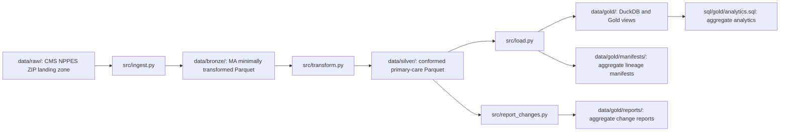

# Architecture overview

## Scope

**Project:** NPPES Provider Directory Change Pipeline

**Geography:** Massachusetts

**Provider cohort:** primary care

### Problem statement

Healthcare operations, provider-directory, and network teams need an auditable way to measure the Massachusetts primary-care directory footprint and identify meaningful changes across NPPES releases. This pipeline replaces manual source-file comparisons with reproducible datasets, quality reports, and aggregate analytics.

### Intended users and questions

The pipeline supports healthcare operations, provider-directory, and network teams. It is designed to answer aggregate questions about provider counts by ZIP code, directory-field completeness, newly observed records, confirmed deactivations, primary-address changes, and taxonomy changes.

## Medallion Architecture

### Source landing: `data/raw/`

CMS NPPES Version 2 ZIP files remain unchanged in the local landing zone. They are intentionally ignored by Git and are not a Medallion layer.

### Bronze: `data/bronze/`

`src/ingest.py` streams the main provider CSV from a ZIP without extracting the full archive. It validates required contract fields, retains needed provider and taxonomy columns, filters to a primary business-practice state of Massachusetts, and writes Parquet plus run metadata.

Bronze is raw-ish rather than raw: it has already been schema-checked, reduced to retained columns, filtered to Massachusetts, and serialized as Parquet. It does not normalize NPIs, ZIP codes, or dates; deduplicate; select individual providers; or apply the primary-care cohort definition.

### Silver: `data/silver/`

`src/transform.py` produces the conformed Version 1 tables:

- `providers_ma_primary_care.parquet` — one row per valid NPI in the cohort.
- `provider_taxonomies.parquet` — one row per NPI-plus-taxonomy code, including non-primary taxonomy assignments.

The Silver boundary revalidates Massachusetts, keeps individual providers, normalizes NPI, ZIP, and date fields, applies the four approved primary-care taxonomy codes, and writes aggregate data-quality metrics. Organization records, advanced practice providers, subspecialties, and non-primary locations remain out of scope.

### Gold: `data/gold/` and `sql/gold/`

`src/load.py` loads Silver Parquet into a local DuckDB database under `data/gold/`. Reruns replace tables and views, and source-versus-loaded row counts are validated. `sql/gold/models.sql` defines reusable Gold views; `sql/gold/analytics.sql` contains aggregate-only analytical queries. `src/report_changes.py` compares Silver snapshots and writes aggregate Markdown and JSON reports under `data/gold/reports/`. `src/run_manifest.py`, called after the PowerShell runner completes its pipeline stages, writes aggregate lineage manifests under `data/gold/manifests/`.

Gold views and reports are analytical outputs, not a complete statewide provider inventory. A weekly incremental file does not provide a baseline, and “newly observed” or “not observed” records do not prove statewide additions or removals.

Gold run manifests record the source ZIP filename and SHA-256 hash, execution time, Git revision when available, output paths, and aggregate Bronze/Silver counts. They provide lineage and reproducibility evidence, not source-data validation.

## Version 1 cohort assumption

An individual provider belongs to the cohort when its primary business-practice location is Massachusetts and any NPPES taxonomy is one of: Family Medicine (`207Q00000X`), Internal Medicine (`207R00000X`), General Practice (`208D00000X`), or Pediatrics (`208000000X`). The matching taxonomy does not need to be marked primary.

## Data limitations

NPPES information is self-reported. An NPI does not prove licensure, credentialing, network participation, appointment availability, or whether a provider accepts new patients. ZIP-level counts describe directory coverage, not care access, capacity, demand, or network adequacy.

For detailed layer guarantees and limitations, see [data_layer_contracts.md](data_layer_contracts.md).
